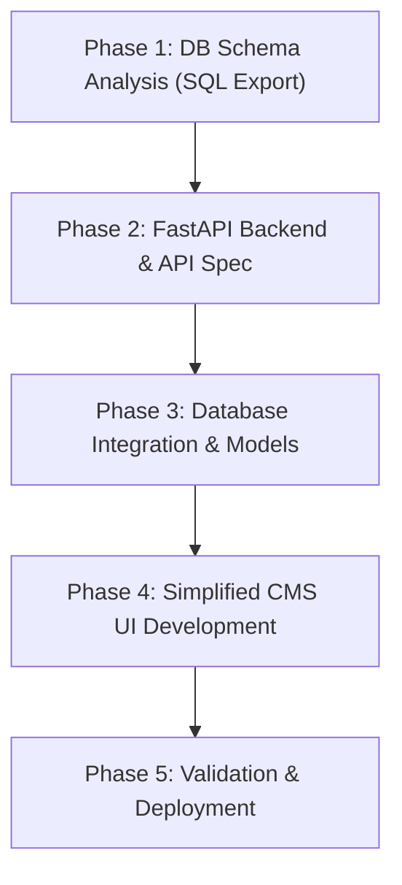

# SKIV Backend Migration & CMS Design Proposal

This document outlines the strategic roadmap for migrating the **SKIV (Sistakaranam Ikyavedika)** backend to **FastAPI** and building an accessible **CMS UI** for administrative tasks.

---

## 📋 The Strategy: What to Do First

To execute this transition smoothly without breaking functionality, we propose the following phased approach.

### 1️⃣ Step 1: Database Schema Analysis (Immediate Action)
Since you have the phpMyAdmin credentials for the old database (`omnibjwt_vedika`):
*   **AI Agent Limitation**: As an AI assistant, I cannot directly log in to external web forms (like cPanel or phpMyAdmin) because of security policies, potential CAPTCHAs, and session handling.
*   **Action for You**: 
    1. Log in to `http://omnibiz.in/cpanel` -> Open **phpMyAdmin**.
    2. Select the database `omnibjwt_vedika`.
    3. Click on the **Export** tab at the top.
    4. Choose the **Quick** export method and select **SQL** format.
    5. Save the `.sql` file, and place it in the project folder (e.g., as `backend/db_dump.sql` or inside a `backend/scratch` folder).
*   **What I will do**: Once the `.sql` file is in the workspace, I will parse the tables, relationships, and data structure to understand the existing tables (users, news, matrimony profiles, etc.) and map them to our new FastAPI models.

---

## 🛠️ Proposed Architecture & Features

### 1. FastAPI Backend
FastAPI will serve as the modern, high-performance API backend.
*   **SQLAlchemy / SQLModel**: For interacting with the database.
*   **Pydantic**: For data validation and response serialization.
*   **JWT Authentication**: Secure login mechanism to distinguish regular users from administrators.
*   **Auto-Generated Docs**: Interactive Swagger documentation (`/docs`) to test API endpoints instantly.

### 2. Elderly-Friendly CMS UI Design
Because the administrators of the website are older people, the CMS UI must be designed with accessibility as the highest priority:

*   **Visual Simplicity**:
    *   **Large, high-contrast typography** (minimum 16px/18px for body text).
    *   **Obvious interactive elements** (large touch targets, clear buttons with labels instead of just icons).
    *   **Color-coded actions** (Green for "Save/Add", Red for "Delete", Yellow/Blue for "Edit").
*   **Simplified Workflows**:
    *   **Single-column form layouts** (easier to read and fill out sequentially).
    *   **No complex nested options** or hidden menus.
    *   **Clear error messages** written in plain language.
    *   **Undo actions** and confirmation modals for critical changes (like deleting profiles).

---

## 🗓️ Implementation Phases

| Phase | Description | Focus |
| :--- | :--- | :--- |
| **Phase 1** | **Database Analysis** | Export old DB schema and write SQLAlchemy models for FastAPI. |
| **Phase 2** | **FastAPI Server Setup** | Set up directory structure, database connection, and basic health check routes. |
| **Phase 3** | **Auth & CRUD Development** | Implement user/admin authentication and API endpoints for Matrimony & News. |
| **Phase 4** | **CMS Admin UI** | Create an ultra-accessible dashboard interface in React for managing the backend data. |
| **Phase 5** | **Frontend Integration** | Connect the main website to the new FastAPI endpoints. |
